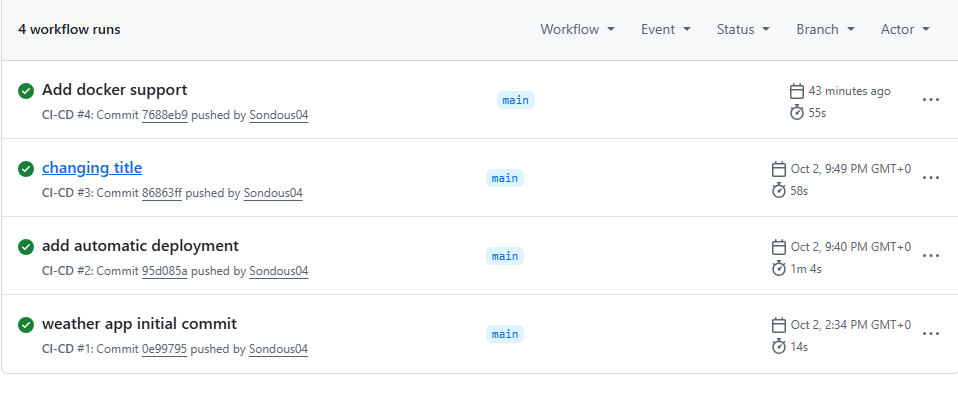
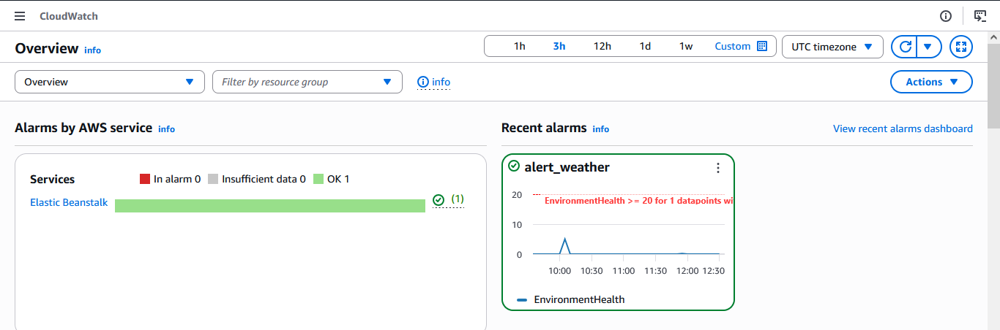
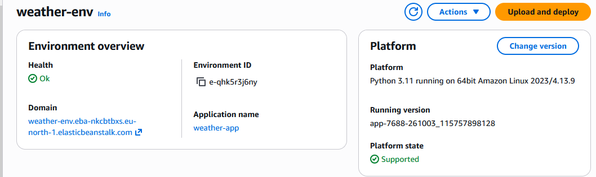
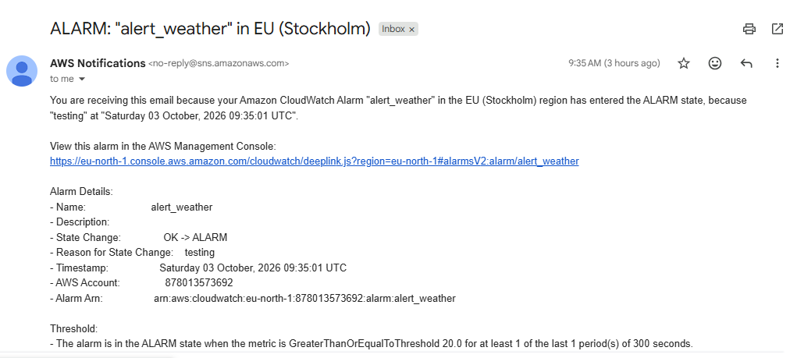

# Weather App: DevOps Project

A small Flask web app that shows the current weather conditions for a city, built to practice a full DevOps lifecycle: version control, automated testing (CI), automated deployment (CD) to AWS, and monitoring.

What the app does

The user types a city (for example London,GB). The backend calls a weather API on RapidAPI and displays the temperature (in °C), conditions, and humidity.

**Pipeline overview**

git push  ->  GitHub Actions: run tests (pytest)  ->  deploy to AWS Elastic Beanstalk  ->  CloudWatch monitoring + email alerts

**Tech stack**
Language / framework:	Python, Flask
External API:	Weather API (RapidAPI)
Tests:	pytest
CI/CD: GitHub Actions
Hosting (PaaS):	AWS Elastic Beanstalk (Python 3.11, region eu-north-1)
Monitoring and alerts:	Amazon CloudWatch and SNS

**How it works**

***1. Application***
app.py contains the Flask app, the API call, and the parsing of the response.
The API returns temperatures in Kelvin, so the app converts them to °C.
The RapidAPI key is read from the RAPIDAPI_KEY environment variable. It is never stored in the code or the repository.
/health returns {"status": "ok"} for quick health checks.
***2. Continuous integration***
test_app.py has 6 tests: response parsing, empty API response, empty input, valid city, invalid city, and the health endpoint.
The API is mocked in the tests, so they run fast and don't use the API quota.
The workflow in .github/workflows/ci.yml runs the tests on every push and pull request.
***3. Continuous deployment***
If the tests pass on main, the workflow deploys to Elastic Beanstalk with eb deploy.
AWS credentials come from a dedicated IAM user stored as GitHub secrets.
The RapidAPI key is set on the server as an Elastic Beanstalk environment variable.
***4. Monitoring***
Elastic Beanstalk enhanced health reporting publishes the EnvironmentHealth metric to CloudWatch.
A CloudWatch alarm (alert_weather) sends an email through an SNS topic when the environment becomes degraded.
The alert was tested by forcing the alarm state and receiving the email.
API usage is checked on the RapidAPI dashboard, because the free plan has a request limit.

**Run it locally**
pip install -r requirements.txt
export RAPIDAPI_KEY=your_key        # Windows PowerShell: $env:RAPIDAPI_KEY="your_key"
python app.py
hen open http://127.0.0.1:5000. Run the tests with pytest.

**What I learned**
Building a pipeline where every push is tested and deployed automatically.
Keeping secrets out of the code (environment variables and GitHub secrets).
Using a dedicated IAM user with limited permissions instead of the root account.
Reading real API responses and adapting the code to them.
Setting up alarms and checking that alerts actually arrive.

**Notes**
The live deployment was shut down after the project to avoid AWS costs.

SCREENSHOOTS
	
Actions

Cloud Watch

Elastic Beanstalk monitoring

alert email

